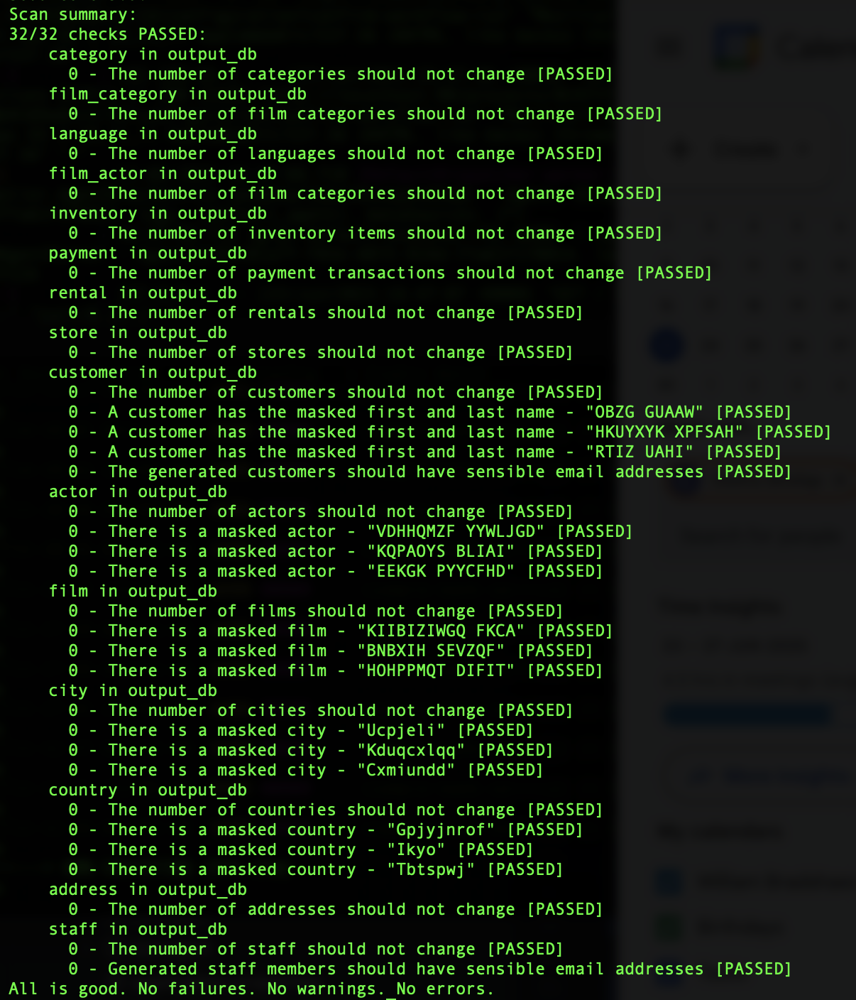

# Synthesized TDK Quest 📽️

In this engaging task, you'll assume the role of an online marketplace development team leader. You'll navigate through the entire application lifecycle, encountering and successfully resolving various challenges.

## Your First Working Day 👔

So, you've just taken the lead of the team, and during the first meeting, you're given all necessary information:

- Your team is responsible for developing and maintaining a modern online marketplace
- The marketplace sells movies and other entertainment and self-development products, both online and offline
- There is a vast network of pickup points worldwide for offline sales and customer service
- From the technical perspective, the marketplace operates as a classic distributed microservice application with a central PostgreSQL database
- You have one production database and two non-production databases: development (dev) and test. These are used for developing and testing new features, as well as bug fixes
- Your team includes developers, QAs, and engineers in charge of operations and infrastructure
- The marketplace has been successfully launched and is functioning quite effectively. Every week, new films featuring renowned actors are released. Thousands of film-related goods are produced and distributed to numerous pickup points, where they are sold or rented out to customers on a daily basis. And all of this information is stored as countless rows in database tables.

The company plans to speed up delivery by 25% this year, and it's your job to make this happen.

The team organized a brainstorming session and identified the obstacles that are slowing down delivery. The following points were left on the marker board after an intense discussion:

- Statistics show that any given feature usually requires more than one release.
- A ready-made feature may function well in the development and test environments, but it could be completely unsuitable for the production environment. This often results in numerous re-releases:
    - For instance, if the team fixes a specific bug, optimizes performance, or adds a new feature in the test environment, there's no guarantee it will work the same way in the production environment
    - Usually, developers and QAs must investigate production issues and perform bug fixes without direct access to the production environment, essentially working in the dark
    - As a result, the team often expends considerable effort and time on re-releases, preventing the business from receiving necessary features in a timely manner
- The company's security team restricts access to the production environment, and, understandably, this decision is justified and necessary
- The main distinction between the dev/test and production environments is in the database, more specifically, in the data it contains. Currently, dev/test databases resemble data silos that contain mostly incomplete, inconsistent, outdated data, which causes issues during comprehensive testing of applications before their release

After the discussion, you decide to meet with the Ops/DBA team to discuss how to make the dev/test databases look more like production ones, and to identify any obstacles in the process. Here's what you discovered:

- Both test and dev databases have been created as copies of the production database a long time ago
- Despite the fact that the data in your databases is outdated, it still contains tons of sensitive data, such as PII and financial data
- A new copy of the production database intended for development and testing purposes is primarily made after major incidents related to the delivery and installation of new releases and patches. Currently, there are no automated processes or pipelines for these types of activities

In a recent team meeting, a decision was made to optimize the bug fixing and performance enhancement processes. The key step is creating a **test database populated with real production data**. This means that data from the production database should be periodically replicated in test/dev databases in the automation mode. Sensitive information, such as customer personal details, finance information and so on, would be anonymized. You have been assigned to complete this task using [Synthesized](https://www.synthesized.io/).

## Challenge 0: Setup your workspace

### What you will need

- Use your favorite command-line terminal, such as `Powershell`, `GitBash`, or `CMD` for Windows, or your preferred terminal for Linux or macOS. To verify it's working correctly, open your terminal and enter the command, replacing the `[YOUR_USERNAME]` placeholder with your name:
    
    ```bash
    echo Hello [YOUR_USERNAME]!
    ```
    
- Docker (version 20.10 or later) with the Docker Compose plugin. In your terminal, run the following command to verify your version, together with the `docker compose` command:
    
    ```bash
    docker --version
    docker compose version
    ```
    
- Git client. Run the following command to check your version:
    
    ```bash
    git version
    ```

- A database client (such as [DBeaver](https://dbeaver.io/download/), [psql](https://www.postgresql.org/docs/current/app-psql.html), [DataGrip](https://www.jetbrains.com/datagrip/), etc.) to connect to Postgres databases, navigate the database schema, and execute simple SQL queries.


### Run the Synthesized TDK Demo Environment

This project relies on the Synthesized TDK. You will need to run a Synthesized demo environment by following the instructions in the [Synthesized User Guide](https://docs.synthesized.io/tdk/latest/user_guide/020_getting_started/installation).

You will need to download and unzip the latest version of governor-compose.zip and unzip it. Navigate to the unzipped directory and run:

   ```bash
    docker compose pull
    docker compose up
   ```

The UI will be available at (http://localhost:80). Use the predefined credentials to log in: `test@synthesized.io` / `Qq12345_`.

### Connect to the Database

The Synthesized TDK Quest uses sample databases bundled within the demo environment. When you launch the Synthesized docker container using the default configuration, it starts a Docker service called `transformed_db`, which runs a PostgreSQL server. This server hosts two databases: `input_source` and `output_source`. 

The `input_source` database is your production database for this task. Treat it like a production databases; you don't need to make any changes here.

The `output_source` database is your non-production database. This is the database that you will be populating using the Synthesized TDK.

The default Synthesized configuration includes two data sources, `input` and `output`, that connect to these data sources. 

To complete this task, you will need to see the contents of the two databases. Using your preferred database client, connect to the two databases using the details below. Please note that the databases are running inside the same docker container as Synthesized. This means that the connection details have different **hostnames** & **ports** when connecting locally vs when connecting through Synthesized.

|  | Input | Output |
|----------|-------|--------|
| Direct JDBC URL | jdbc:postgresql://localhost:5433/input_source | jdbc:postgresql://localhost:5433/output_source |
| Synthesized TDK JDBC URL | jdbc:postgresql://transformed_db:5432/input_source | jdbc:postgresql://transformed_db:5432/output_source |
| username | apiuser | apiuser |
| password | apipassword | apipassword |

Once you have connected to the databases, take a look at the structure of the different tables. You should see that input contains data about actors, films, customers and staff. On the other hand, the output database is empty.

### Setup your first Workflow

To populate the non-production database, you're going to use Synthesized's TDK. 

If you're not yet familiar with Synthesized TDK, you should learn about it by visiting the "[What is TDK?](https://docs.synthesized.io/tdk/latest/user_guide/getting_started/what_is_tdk)" page in the official documentation, then reading about [Masking](https://docs.synthesized.io/tdk/latest/user_guide/030_masking_your_data/masking). 

From the home page create a new workflow and name it whatever you like. Choose to create an empty workflow. You will be prompted to select data sources, which should be automatically filled in as `input` and `output`. These are predefined data sources that connect to the demo database. 

When you have created the workflow, you will see it has added some default setup. Replace the workflow with the following config:

   ```yaml
    default_config:
        mode: MASKING

    schema_creation_mode: DROP_AND_CREATE
    safety_mode: "RELAXED"
    global_seed: 42
   ```

Note - `global_seed: 42` is used here to ensure that the random data you generate will match the tests. Make sure you include that line for the duration of this task otherwise the automatic validation will fail. 

Paste the example workflow config into the editor window and save. Once you have saved, run the workflow against the `output` data source. This will mask all of the data in the input database and use it to populate the 

### Validating Challenge 0

The Synthesized TDK Quest certification includes a set of commands to validate your test results. These can be found by downloading the git repository.

   ```bash
    git clone <https://github.com/synthesized-io/tdk-quest.git>
    cd tdk-quest
   ```

The challenge validators work by connecting to your output database and checking the contents. It will connect to the database using the credentials stored in `database_configuration.yaml`. If you are running the Synthesized TDK using the default docker config, you won't need to change the `database_configuration.yaml`. If you are using a different database, fill in the details in that file.

You can now validate that you have set everything up correctly by running the first validation command:

   ```bash
    docker compose run check_env_ready
   ```

If your environment is prepared correctly, you should see:


If you have any difficulties, check the following troubleshooting sections:

<details>
<summary>Could not connect to data source "output_db"</summary>
This means that the validator couldn't access the output database. Either the database isn't running locally, or the `database_configuration.yaml` file does not have the correct credentials. 

Check to see if your database client is able to access the database. 

If the database client can't access the database either, make sure the Synthesized Governor docker compose image is running.

If the database client can access the database but the tests can't, update `database_configuration.yaml`.
</details>

<details>
<summary>Metrics were not computed</summary>
This is the error that is reported with the validator can access the database, but can't access the individual tables. Typically it means that you have not run the Synthesized workflow yet. Run the workflow, and use your database client to check that the output database has been populated.
</details>

<details>
<summary>Some of the tests are failing</summary>
If some of the setup tests are failing, it means there's an issue in the workflow. Make sure to copy the workflow from the `Setup your first Workflow` section exactly.

If you are missing the `mode: MASKING` setting, the system won't be generating the right masked data.

If you are missing the `global_seed: 42` setting, the system could be masking data correctly, but won't be generating the values we are looking for. 
</details>

When the tests pass, congratulations! You have successfully set up the team's new non-production database.

## Challenge 1: Masking the right data

With the new non-production database, the team can start testing properly. It's great that it doesn't include any personal data, but the team start commenting that some data doesn't look the way they expect it to. 

Luckily, with Synthesized you are in control of how data should be processed. After taking a look at the synthesized output, you set yourself a few requirements:

**Requirement 1.1**: The `actor` and `film` data in the system is publicly available, and should not be masked. 
**Requirement 1.2**: While location data is sensitive, the `city` and `country` data in the system is not confidential and should remain as is. 
**Requirement 1.3**: The `address` and `staff` data in the system are sensitive. We should use `GENERATE` mode to make the data more realistic. 

<details>
<summary>Hints</summary>

Synthesized has three [transformation modes](https://docs.synthesized.io/tdk/latest/user_guide/130_reference/configuration_reference#UserTransformationMode): `MASKING`, `GENERATION`, and `KEEP`. 
</details>

### Validating Challenge 1

To solve this challenge, you need to edit the Synthesized workflow so that the synthesized data meets all of the requirements. Make your edits, save, run the workflow, then check the database. 

When you are sure that the data in the database has left the actor, film, city, and country data as it was, check your work by running:

   ```bash
    docker compose run check_challenge_1
   ```

Note that this is `check_challenge_1`, rather than `check_setup`. 

Update the workflow configuration file and rerun the transformation and tests until you receive the `All is good` message in your terminal.

## Challenge 2: Keeping the engineering team happy during Black Friday

The sales team plans to announce up to 80% discounts during Black Friday, which is a month away. This strategy is anticipated to significantly boost our customer base and sales during this period. Consequently, we will need to expand our staff by 20% to handle the surge in orders.

It's crucial to ensure that all your systems can successfully handle the anticipated high load, preventing any loss of profits. As the head of the development team, it falls on you to confirm that the marketplace can withstand this increased load and to make any necessary optimizations to accommodate the expected traffic.

Use the workflow configuration file you created in the first challenge as a starting point, and make changes to meet the following requirements:

**Requirement 2.1**: Generate five times as many records in the `customer` table
**Requirement 2.2**: Double the number of payment transactions by creating new records in the `customer` table
**Requirement 2.3**: Increase the staff count by 20% by generating new records in the `staff` table

<details>
<summary>Hints</summary>

You can set how much data to synthesize by using `target_ratio` (or `target_rows`). You can produce any number of rows in `GENERATE` mode. In `MASKING` mode or `KEEP` mode you can't generate more rows than the input data. 

</details>

### Validating Challenge 2

Once you have changed your workflow configuration, run the workflow and examine the results in the output database.

When you are happy, check your work by running:
    
   ```bash
    docker compose run check_challenge_2
   ```

Update the workflow configuration file and rerun the transformation and tests until you receive the `All is good` message in your terminal.

## Challenge 3: Producing data to test our features

The team is hard at work building new features. They are focused on two key projects:
* Keeping records on which staff members are inactive
* Predicting demand in different districts

To ensure these features are working properly, we want to test these use cases against realistic data. However, the current production data doesn't have enough information for us to run these tests. Thankfully, Synthesized allows you to generate data that meets the requirements for the two projects. 

To generate realistic data here you will need to use the [categorical generator](https://docs.synthesized.io/tdk/latest/user_guide/130_reference/transformations#CategoricalGeneratorParams), [format preserving hashing generator](https://docs.synthesized.io/tdk/latest/user_guide/130_reference/transformations#FormatPreservingHashingParams), and the [person generator](https://docs.synthesized.io/tdk/latest/user_guide/130_reference/transformations#PersonGeneratorParams). 

### Challenge 3a - Recording staff activity
Until now, when staff members have left the company, they were deleted from the database. The company has decided to change the system so that instead of deleting staff, they will be marked as inactive instead. They keep track of this by setting the `public.staff.active` column to false. Currently, all of our production data is for active staff members, but we need test data that includes inactive staff.

**Requirement 3a**: Update the system to generate 80% active staff, and 20% inactive staff.  
<details>
<summary>Hints</summary>

The [categorical generator](https://docs.synthesized.io/tdk/latest/user_guide/130_reference/transformations#CategoricalGeneratorParams) can be used to generate values that automatically match the existing data, or you can use it to provide possible values and it will generate data that matches.

</details>

### Challenge 3b - Predicting demand
The team's machine learning engineers have been hard at work building models that can predict which geographical regions will have the greatest demand. 

Addresses are key personally identifiable information. Up until now we have been using completely synthesized data for the `public.address` table. To properly test our new demand prediction system we need data that matches our real users, while maintaining their privacy.

To get the most realistic data, we need a few things:

**Requirement 3b.1**: The address should be masked and maintain the same structure as the original address  
<details>
<summary>Hints</summary>

If you select `MASKING` mode, [format preserving hashing](https://docs.synthesized.io/tdk/latest/user_guide/130_reference/transformations#FormatPreservingHashingParams) is selected automatically for certain columns.

</details>

**Requirement 3b.2**: The synthesized postal code should be a number that has the same length as the original postal code  
<details>
<summary>Hints</summary>

The [format preserving hashing generator](https://docs.synthesized.io/tdk/latest/user_guide/130_reference/transformations#FormatPreservingHashingParams) can be used to maintain the structure of the input data.
</details>

**Requirement 3b.3**: District isn't personally identifiable information, so let's keep the values from the source data 
<details>
<summary>Hints</summary>

Transformation modes (`MASKING`, `GENERATION`, & `KEEP`) can be set at the column level, the table level and the workflow level. The most specific mode will be used, so a column level setting will override table level settings. 
</details>

**Requirement 3b.4**: Generate new but realistic phone numbers. These should be formatted as national phone numbers rather than international numbers.
<details>
<summary>Hints</summary>

The [person generator](https://docs.synthesized.io/tdk/latest/user_guide/130_reference/transformations#PersonGeneratorParams) can be used to generate all sorts of information that could be associated with a person. 
</details>

### Validating Challenge 3

Once you have changed your workflow configuration, run the workflow and examine the results in the output database.

When you are happy, check your work by running:
    
   ```bash
    docker compose run check_challenge_3
   ```

Update the workflow configuration file and rerun the transformation and tests until you receive the `All is good` message in your terminal.

## Summing up the results

Congratulations! If you've reached this point, it implies that:

- You have successfully completed all assigned tasks
- Both your team and management are satisfied
- You've become proficient in the basic functionality of Synthesized TDK

We hope that Synthesized will be beneficial in addressing your needs for high-quality, realistic, and secure data for testing and development. We're ready to answer all your questions and provide necessary assistance. Please feel free to email us at [support@synthesized.io](mailto:support@synthesized.io)

Additionally, we recommend joining our social media, where you can find more useful information related to test, fake, synthetic, obfuscated, anonymized, and generated data, among other related topics:

- [Twitter](https://twitter.com/synthesizedio)
- [Linkedin](https://www.linkedin.com/company/synthesized)
- [Medium](https://synthesized.medium.com/)

And finally, we ask you to fill in [a little questionnaire](https://docs.google.com/forms/d/e/1FAIpQLSdawUD6p1ld-brgG6vVJPOgGA_-yc4NPJko_rcmFHHIE19O7A/viewform?usp=sharing) that will help us become even better and solve our customers' problems even more effectively.

Thank you for your attention and support. Let's stay in touch.

Synthesized TDK Team
