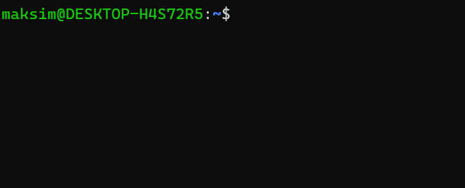

# Synthesized TDK Quest 📽️

Try to resolve the following problems using [Synthesized TDK](https://docs.synthesized.io/tdk/latest/) data generation, subsetting, and masking tools.

As the team leader in your software development company, you'll be involved in all stages of the software application life cycle. This involves the development, maintenance, and scaling of a comprehensive, modern online marketplace with an extensive network of pickup points worldwide.

## Technical requirements

Before starting the quest, we must ensure that you have some necessary tools on your PC:

- Command-line terminal such as `Powershell`, `GitBash`, or `MinGW` for Windows, or your preferred terminal for Linux or macOS. Open your terminal and enter the command, replacing the `[YOUR_USERNAME]` placeholder with your name:
    
    ```bash
    echo Hello [YOUR_USERNAME]!
    ```
    
- Docker, minimum version 20.10 with Docker Compose plugin. Type in your terminal this command for showing version and existing `docker compose` command:
    
    ```bash
    docker --version
    docker compose version
    ```
    
- Git client, type in your terminal:
    
    ```bash
    git version
    ```

Consequently, you should end up with something like this:



Moreover, you'll need a code editor (such as VS Code) and a database client (such as [DBeaver](https://dbeaver.io/download/), [psql](https://www.postgresql.org/docs/current/app-psql.html), [DataGrip](https://www.jetbrains.com/datagrip/) etc) to connect to the test Postgres databases, navigate through the database schema, and execute simple SQL queries.

## 1. Spin up test environment 0️⃣🧪

So, your team is in the final stages of developing the new online marketplace. While the application is complete, its PostgreSQL database is currently devoid of data. This scarcity of data complicates acceptance and load testing and demonstrating the application to the customers and investors prior to production implementation. Therefore, you've been tasked with generating sufficient realistic data using [TDK generation mode](https://docs.synthesized.io/tdk/latest/user_guide/tutorial/generation).

Work has already begun, and your task is to enhance the current process and scenarios.

Clone the repository with practices from GitHub:

```bash
git clone https://github.com/synthesized-io/tdk-quest.git
cd tdk-quest
git checkout init
```

Now we need two databases. The first is provided by your development team; it contains the schema of the online marketplace but no data. The second is an entirely empty database, devoid of both schema and data. This database will be used to generate fake, realistic data for the testing and management team. To retrieve both databases on your PC, you can run this simple Docker command:

```bash
docker compose run databases
```

After the command is completed, a whale will appear in your console:

```bash
$ docker-compose run databases
[+] Building 0.0s (0/0)                                                                               docker:default
[+] Creating 2/0
 ✔ Container input_db   Running                                                                                 0.0s
 ✔ Container output_db  Running                                                                                 0.0s
[+] Building 0.0s (0/0)                                                                               docker:default
 ______________________________________
/ Both databases have been started and \
\ are ready for TDK exercises!         /
 --------------------------------------
    \
     \
      \
                    ##        .
              ## ## ##       ==
           ## ## ## ##      ===
       /""""""""""""""""___/ ===
  ~~~ {~~ ~~~~ ~~~ ~~~~ ~~ ~ /  ===- ~~~
       \______ o          __/
        \    \        __/
          \____\______/
```

This indicates that you have two databases running on ports `6000` (a database with schema only, will call it the `source database`) and `6001` (an entirely empty database for our exercises, will call it the `target database`) on your `localhost`.

Connect to both databases using your preferred database client. Use `postgres` as the `username` and `password` for both. Determine the number of tables in each database and count the number of rows in the `customer` table for each.

The existing TDK configuration file (`config_generation_from_scratch.tdk.yaml`) can already generate one fake row for each table, which includes realistic values for the columns `first_name`, `last_name`, `email`, and `username` in the `staff` table, for demonstration purposes.

To proceed, run the TDK transformation process using this configuration file:

```bash
docker compose down; docker-compose run tdk
```

Once the TDK transformation is complete, connect to the output database using your database client. Verify that the schema from the source database has been copied and that there is one row in each table. You can confirm this by checking the row count in two or three randomly selected tables. Additionally, connect to the source database to ensure that it remains unchanged. Confirm that two or three randomly selected tables still have no rows.

At this point, you should edit the TDK configuration file (`config_generation_from_scratch.tdk.yaml`) using your preferred code editor to improve this data generation scenario as outlined below:

- Generate 100 rows for reference tables, including:
    - `country`
    - `city`
    - `category`
    - `film_category`
    - `language`
- Generate 10,000 rows for all other tables
- Ensure that realistic data is generated for the columns `first_name`, `last_name` and `email` for the `customer` table

Run our automate data tests against the target database:

```bash
docker compose run check scan -d output_db -c /sodacl/configuration.yaml /sodacl/checks_for_generation_from_scratch.yaml
```

And ensure that we have 15 failures tests (this can be found in the last line of the output log):

```bash
[11:45:45] Oops! 15 failures. 0 warnings. 0 errors. 1 pass.
```

To meet the requirements and fix our tests (we need 0 failures/warnings/errors and 16 passing tests), use the following resources:

- The current configuration file as a reference
- The official [Synthesized TDK documentation](https://docs.synthesized.io/tdk/latest/), particularly the [TDK transformations reference](https://docs.synthesized.io/tdk/latest/user_guide/reference/transformations) page
- The official [Synthesized TDK Demo repositories](https://github.com/synthesized-io/tdk-demo/tree/main/postgres) based on PostgreSQL and [Pagila](https://github.com/devrimgunduz/pagila) sample database

After making the necessary changes in the configuration file, restart the TDK transformation:

```bash
docker compose down; docker-compose run tdk
```

Then, connect to the target database using your database client and verify that the generated data complies with the requirements.

To thoroughly examine your generated data in the source database, run tests that cover new requirements again:

```bash
docker compose run check scan -d output_db -c /sodacl/configuration.yaml /sodacl/checks_for_generation_from_scratch.yaml
```

If everything is correct, you will see text indicating successful tests:

```bash
[11:24:42] All is good. No failures. No warnings. No errors.
```

If you still have failing tests, update the TDK configuration file and rerun the TDK transformation and tests until you receive the `All is good` message in your terminal.
